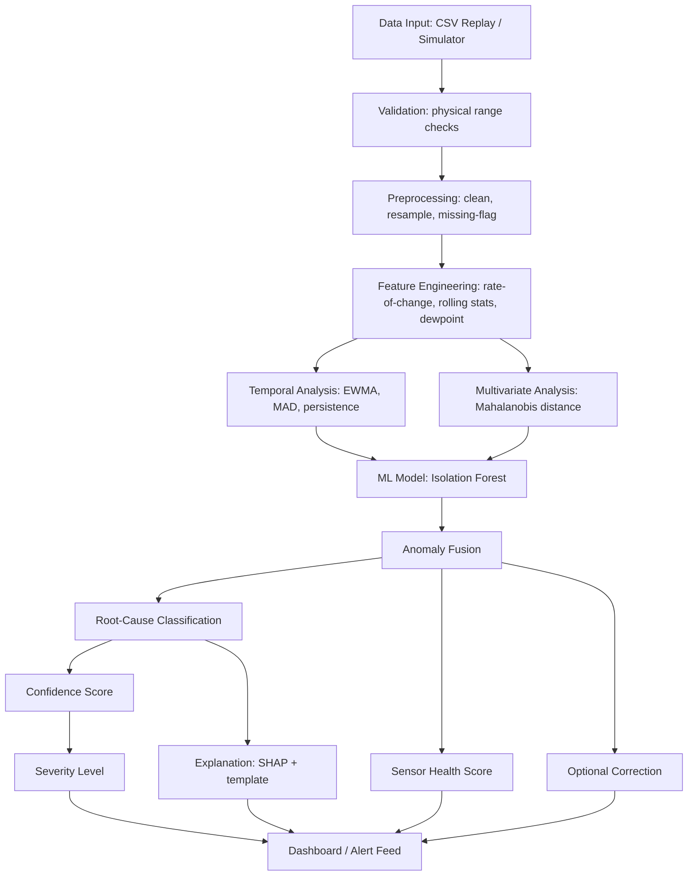
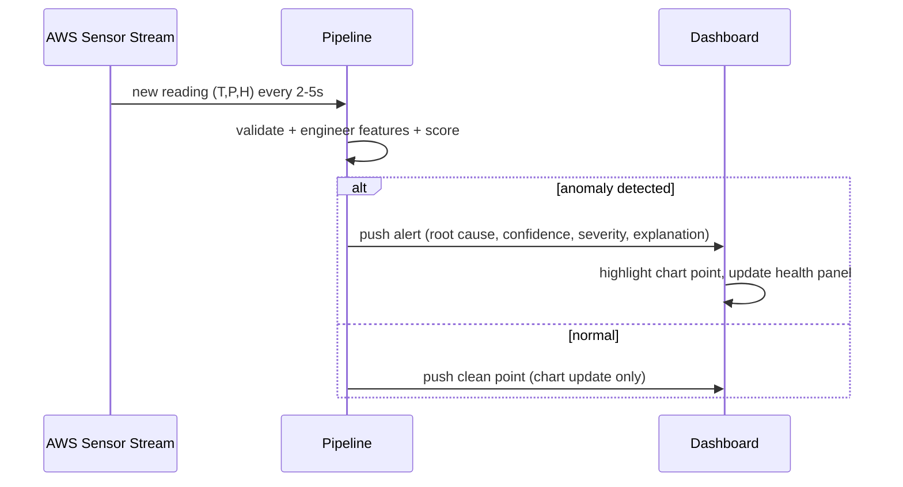

# IMPLEMENTATION_SCHEDULE.md — Sep 7 to Sep 10

## FOLDER STRUCTURE
```
skyguard-ai/
├── data/
│   ├── raw/                # downloaded historical AWS/NOAA-ISD CSV
│   └── processed/          # cleaned, resampled data
├── src/
│   ├── simulator.py
│   ├── preprocessing.py
│   ├── detector.py
│   ├── rootcause.py
│   ├── scoring.py
│   ├── health.py
│   ├── explain.py
│   ├── correction.py
│   └── pipeline.py
├── app.py                  # Streamlit dashboard
├── tests/
│   └── test_pipeline.py
├── results/
│   └── metrics.csv
├── docs/
│   ├── PROJECT_CONTEXT.md
│   ├── TODO_STATUS.md
│   ├── PROMPTS.md
│   └── DEMO_AND_JUDGES.md
├── requirements.txt
├── .gitignore
└── README.md
```

## MERMAID — ARCHITECTURE


## MERMAID — USER/ALERT FLOW


## CODING ORDER (staged — one component per session, test before moving on)
1. `simulator.py` — no dependencies. Test: prints/streams rows with injected anomaly flags matching config.
2. `preprocessing.py` — depends on simulator output shape. Test: rolling features computed, no NaN leaks.
3. `detector.py` — depends on preprocessing features. Test: known injected spike gets high anomaly score.
4. `rootcause.py` — depends on detector's fired sub-signals. Test: spike -> TEMPERATURE_SPIKE label.
5. `scoring.py` — depends on detector + rootcause. Test: confidence/severity move sensibly with magnitude.
6. `health.py` — depends on scoring history. Test: repeated anomalies degrade score over time.
7. `explain.py` — depends on detector's fitted model + feature vector. Test: SHAP explanation text generated.
8. `correction.py` — depends on preprocessing. Test: corrected value close to pre-anomaly trend.
9. `pipeline.py` — orchestrates 1-8. Test: full run on 500 rows, no crash.
10. `app.py` — depends on pipeline. Test: dashboard loads locally via `streamlit run app.py`.
11. `tests/test_pipeline.py` — depends on all. Test: precision/recall/F1 computed and saved.

## DATASETS (ranked)
| Rank | Dataset | Source | Vars | Resolution | Coverage | License | Notes |
|---|---|---|---|---|---|---|---|
| BEST | NOAA Integrated Surface Database (ISD) / ISD-Lite | NOAA NCEI (ncei.noaa.gov) | Temp, dewpoint(->RH), pressure, wind | Hourly, 1901-present | ~35,500 global stations incl. India | Public domain, free, no restriction | Real AWS-like QC'd data; derive RH from T+dewpoint (Magnus formula); largest, most credible for a MoES/IMD-themed PS |
| GOOD | Kaggle "Weather Station Data" / historical hourly weather datasets | Kaggle | T, P, RH (varies by dataset) | Hourly | City/region-specific | Varies (check per-dataset license, most CC0/ODbL) | Faster to load, already tabular; verify license before submission |
| GOOD | IMD open data (data.gov.in weather layers) | data.gov.in / IMD | T, RH, rainfall (P less consistent) | Daily/hourly (station-dependent) | India | Government Open Data License India (free reuse with attribution) | Strong "India relevance" narrative for MoES judges |
| BACKUP | Synthetic-only generator (no base dataset) | Self-generated using realistic diurnal/seasonal formulas | T,P,H | Any | N/A | N/A (self-made) | Use only if download fails during the event; slower to make "look real" |

Recommendation: use NOAA ISD/ISD-Lite for one or two representative stations (download small subset, e.g. 1-3
months hourly) as the clean baseline, since it's the most authoritative freely-licensed T/P/H source, and layer
the official-sanctioned synthetic anomaly injection on top (this exactly matches "evaluated on anomaly injected
data" per the PS).

## TESTING STRATEGY
13 scenarios, each run through `test_pipeline.py` against injected ground truth:
normal readings, temperature spike, temperature drop, pressure anomaly, humidity anomaly, frozen sensor,
gradual drift, missing values, communication failure, simultaneous multi-anomaly, genuine extreme-weather-like
event (multi-variable coherent change), noisy data, deliberate sub-model disagreement case.
Metrics: Precision, Recall, F1, False Positive Rate, False Negative Rate on the injected labels (report per
anomaly class + overall). ROC-AUC optional if you compute a continuous anomaly score before thresholding.
Target talking point for judges: report a specific number, e.g. "F1 = 0.9x on injected test set, false-positive
rate on genuine-weather-like segments = Y%" — a concrete number beats a vague claim.

## DAY-BY-DAY PLAN (2-person team, Person A / Person B)

### DAY 1 — Sep 7 (Mon): Setup + Data + Simulator + Detection core
- 12:00-13:00 — Both: install Python 3.11, VS Code, Git, create GitHub repo `skyguard-ai`, run
  `git init`, `git add .`, `git commit -m "init"`, `git remote add origin <url>`, `git push -u origin main`.
- 13:00-14:00 — A: download NOAA ISD subset for 1 station (3 months hourly); B: set up venv,
  `pip install pandas numpy scikit-learn shap plotly streamlit`, freeze `requirements.txt`.
- 14:00-16:00 — A: clean dataset into `data/processed/clean.csv` (T,P,H,timestamp); B: paste PROMPT 1 into
  Antigravity/Claude to scaffold repo structure.
- 16:00-18:00 — Both (pair): build `simulator.py` with anomaly injection functions (PROMPT 2). Test: run
  `python -m src.simulator` and confirm printed stream includes injected spike at the configured index.
- 18:00-20:00 — A: `preprocessing.py` (PROMPT 3); B: start `detector.py` rule layer (physical bounds:
  T in [-40,55]°C, P in [870,1085] hPa, RH in [0,100]%).
- 20:00-21:00 — Commit: `git add . && git commit -m "Day1: simulator + preprocessing + rule checks"`
  `git push`. Update TODO_STATUS.md.
- Expected end-of-day output: raw data cleaned, simulator streams with injectable anomalies, basic rule-based
  flags work on obvious spikes.
- If NOAA download fails: fall back to Kaggle dataset (GOOD rank) — do not spend >45 min stuck on one source.

### DAY 2 — Sep 8 (Tue): Full detection pipeline + scoring + explainability
- 09:00-11:00 — B: finish `detector.py` (rolling z-score/MAD, Mahalanobis, IsolationForest fit + fusion,
  PROMPT 4). Test: injected temperature spike scores > 0.8 anomaly score; normal data stays < 0.3.
- 11:00-13:00 — A: `rootcause.py` (PROMPT 5). Test: each injected anomaly type maps to its expected label
  in >80% of injected cases on a held-out slice.
- 13:00-14:00 — Break/buffer.
- 14:00-16:00 — B: `scoring.py` confidence+severity (PROMPT 6); A: `health.py` sensor health score (PROMPT 7).
  Test: repeated anomalies over a rolling window visibly drop the health score band.
- 16:00-18:00 — B: `explain.py` SHAP TreeExplainer + template sentences (PROMPT 8). Test: force one anomaly,
  confirm output sentence names the correct dominant variable.
- 18:00-19:30 — A: `correction.py` rolling-median/short regression corrected-value estimate (never overwrite
  original; store both). Test: corrected value for a spike is close to the pre-spike trend, not equal to the
  spiked value.
- 19:30-20:30 — Both: `pipeline.py` orchestrator wiring 1-8 together (PROMPT 10). Test: full run on 500 rows,
  no crash, produces one row per timestamp with all fields populated.
- 20:30-21:00 — Commit + push + update TODO_STATUS.md + DECISIONS if anything changed.
- Expected end-of-day output: end-to-end pipeline runs offline on a CSV and produces anomaly+explanation+health
  output table.

### DAY 3 — Sep 9 (Wed): Dashboard + Testing + Deployment
- 09:00-11:00 — A: paste Stitch prompt, get design reference; B: start `app.py` Streamlit skeleton
  (metrics row, chart, alert feed) (PROMPT 9).
- 11:00-13:00 — Both: connect `app.py` to `pipeline.py` via a simple loop reading the simulator's next row
  every N seconds and appending to `st.session_state` history; render chart + alerts + health panel.
- 13:00-14:00 — Break/buffer.
- 14:00-16:00 — A: build `tests/test_pipeline.py` covering the 13 scenarios (PROMPT 11), compute
  precision/recall/F1/FPR, save `results/metrics.csv`; B: polish UI styling per Stitch reference (colors,
  spacing, severity badges).
- 16:00-18:00 — Both: deploy to Streamlit Community Cloud (push to GitHub, connect repo, verify public URL)
  (PROMPT 12). Test: open the public link on a phone/another laptop, confirm it loads and streams.
- 18:00-20:00 — Both: run through the demo script end-to-end 3 times, fix any visible bugs (PROMPT 13).
- 20:00-21:00 — Commit + push + freeze FINAL_SPEC in PROJECT_CONTEXT.md status to "DEMO READY".
- Expected end-of-day output: publicly deployed, working dashboard; metrics.csv with real numbers; demo
  rehearsed at least 3 times.

### DAY 4 — Sep 10 (Thu): Buffer, presentation, backup demo, submission
- 09:00-11:00 — Both: record a 2-minute backup video of the full demo (screen recording) in case live
  deployment fails during judging.
- 11:00-13:00 — A: build the 6-8 slide presentation (see DEMO_AND_JUDGES.md); B: write README.md with setup
  instructions, architecture diagram, and metrics.
- 13:00-15:00 — Both: rehearse judge Q&A using DEMO_AND_JUDGES.md (50 questions), assign who answers what.
- 15:00-17:00 — Buffer for last bug fixes only — no new features (P3 rule: do not build anything new today).
- 17:00-18:00 — Final commit, tag release `git tag v1.0 && git push --tags`, submit.

## GIT WORKFLOW (beginner-friendly, no unnecessary branching)
Single `main` branch is enough for a 2-person 3-day project. Commit after every working milestone, not every
line. Sequence per session: `git pull` (start of session, avoid conflicts) → work → `git add .` →
`git commit -m "clear message: what changed and why"` → `git push`. Only use a branch if both people must edit
the same file simultaneously (rare here since files are modular); otherwise divide work by file to avoid
merge conflicts entirely.
